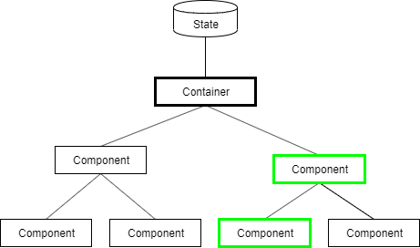

# Containers

In vielen modernen Web-Frameworks hat sich das Konzept der zustandslosen und zustandsabhängigen Komponenten durchgesetzt. Auch bekannt als **statelss vs stateful**, **smart vs dumb components** oder auch **container components vs presentational components**

## stateless / presentational components

* **Halten keinen State!**
* Stellen lediglich Daten dar die über **Inputs** an sie übergeben werden.
* Informieren Parent über Ereignisse via **Outputs**.
* Enthalten keine bzw. nur Anzeigelogik.

## stateful / container components

* Halten den State 
* Reagieren auf Ereignisse in den Child Komponenten und aktualisieren den State.
* Können Business-Logik enthalten.

## Beispiel

**Schritt 0**

**Schritt 1**

* Ereignis wird in einer Kind-Komponente ausgelöst. (Nutzereingabe, Klick auf Button, Selektion im Grid, ...)
* Da es sich um eine **stateless component** handelt wird das Ereignis an die parent component weitergegeben

**Schritt 2**

* Parent component ist ebenfalls **stateless**, Event wird weitergegeben.

**Schritt 3**

* Parent component ist **stateful** und reagiert entsprechend auf das Event (macht Web-Request, führt Berechnung durch, ...)
* State wird anschließend verändert.

**Schritt 4**

* Angular erkennt dass sich der state geändert hat und führt change detection durch
* Alle Komponenten denen der state bzw. Teile davon per **Input** übergeben wurden werden aktualisiert.

## Vor- und Nachteile

**Vorteile**

* Trennung von Business Logik und Anzeige
* Single point of truth - State wird nur an einer Stelle gehalten und manipuliert.
* Stateless components enthalten keine bzw. nur Anzeigelogik und sind lediglich von ihren Inputs abhängig
  * Einfach wiederverwendbar
  * Einfach testbar
  * Tests können ggf. ausgelassen werden

**Nachteile**

* Tiefer verschachtelte Component Trees
* Events müssen uU. über mehrere Ebenen durchgeschliffen werden
  * Lösung: Kann durch [ng-content](https://blog.angular-university.io/angular-ng-content/) teilweise umgangen werden
* Container können sehr komplex / groß werden und schwer zu testen sein
  * Lösung: Auslagern von Logik in einfach testbare **services**
